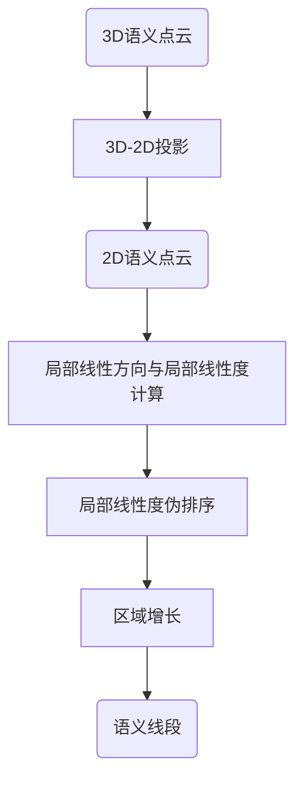

面向AVP应用的语义线段拟合与配准方案

## 语义线段拟合方案设计

### 方案交流记录

- 基于随机采样和区域增长的线段提取方法；
- 使用PCA算法确定每段线段的中心点和方向，进而计算线段端点；
- 对于语义标签为停车位的像素点，对各个边上的线段进行融合，并通过线段所在直线进行相交的方式确定停车位的四个顶点；
- 对于禁停区语义类别，可以尝试线拟合的方式，若无法获得理想效果，再考虑图像腐蚀等操作的可行性；
- 对于转向线和导向线等没有明显呈线状分布的语义类别，考虑提取轮廓信息，具体方案待定。

### 区域增长算法(LSD)

区域增长参考LSD线段提取算法中的region grow算法流程：


LSD中region grow代码实现：

```c++
/*----------------------------------------------------------------------------*/
/** Build a region of pixels that share the same angle, up to a
    tolerance 'prec', starting at point (x,y).
 */
static void region_grow( int x, int y, image_double angles, struct point * reg,
                         int * reg_size, double * reg_angle, image_char used,
                         double prec )
{
  double sumdx,sumdy;
  int xx,yy,i;

  /* check parameters */
  if( x < 0 || y < 0 || x >= (int) angles->xsize || y >= (int) angles->ysize )
    error("region_grow: (x,y) out of the image.");
  if( angles == NULL || angles->data == NULL )
    error("region_grow: invalid image 'angles'.");
  if( reg == NULL ) error("region_grow: invalid 'reg'.");
  if( reg_size == NULL ) error("region_grow: invalid pointer 'reg_size'.");
  if( reg_angle == NULL ) error("region_grow: invalid pointer 'reg_angle'.");
  if( used == NULL || used->data == NULL )
    error("region_grow: invalid image 'used'.");

  /* first point of the region */
  *reg_size = 1;
  reg[0].x = x;
  reg[0].y = y;
  *reg_angle = angles->data[x+y*angles->xsize];  /* region's angle */
  sumdx = cos(*reg_angle);
  sumdy = sin(*reg_angle);
  used->data[x+y*used->xsize] = USED;

  /* try neighbors as new region points */
  for(i=0; i<*reg_size; i++)
    for(xx=reg[i].x-1; xx<=reg[i].x+1; xx++)
      for(yy=reg[i].y-1; yy<=reg[i].y+1; yy++)
        if( xx>=0 && yy>=0 && xx<(int)used->xsize && yy<(int)used->ysize &&
            used->data[xx+yy*used->xsize] != USED &&
            isaligned(xx,yy,angles,*reg_angle,prec) )
          {
            /* add point */
            used->data[xx+yy*used->xsize] = USED;
            reg[*reg_size].x = xx;
            reg[*reg_size].y = yy;
            ++(*reg_size);

            /* update region's angle */
            sumdx += cos( angles->data[xx+yy*angles->xsize] );
            sumdy += sin( angles->data[xx+yy*angles->xsize] );
            *reg_angle = atan2(sumdy,sumdx);
          }
}
```

### 语义标线的线段拟合算法流程



- 3D语义点云投影到2D平面表示；
- 对语义点的局部线性方向\\(\boldsymbol v\\)以及局部线性度\\(\gamma\\)进行计算，具体计算方法为：首先对局部点云进行PCA分析，两个主成分对应特征值分别为\\(\lambda_1\\)和\\(\lambda_2\\)，且满足\\(\lambda_1\ge \lambda_2\ge0\\)，则局部线性方向\\(\boldsymbol v\\)为\\(\lambda_1\\)所对应特征向量的方向，局部线性度\\(\gamma\\)定义为

$$
\gamma=1-\frac{\lambda_2}{\lambda_1}\in[0,1]
$$

- 根据局部线性度的值，对某一类的语义点进行伪排序，具体方法为：根据局部线性度，划分\\(N\\)个bin，将语义点放入合适的bin中。

- 按照局部线性度由大到小，取出语义点作为种子点进行区域增长，增长条件为语义点之间的欧氏距离以及局部线性方向与区域线性方向的一致程度。

- 区域内线段信息由区域语义点均值\\(\boldsymbol\mu_N\\)与区域线性方向\\(\boldsymbol v_N\\)组成，而\\(\boldsymbol v_N\\)则通过对区域协方差矩阵\\(\boldsymbol C_N\\)进行特征值分解得到，具体为其最大特征值所对应的特征向量。在区域增长的过程中，\\(\boldsymbol\mu_N\\)以及\\(\boldsymbol C_N\\)均可以进行增量式的更新：

  $$
  \boldsymbol\mu_{N+1}=
  \frac{N}{N+1}
  \left(
  \boldsymbol\mu_N+
  \frac{1}{N}\boldsymbol p_{N+1}
  \right) 
  $$

  $$
  \boldsymbol C_{N+1}=
  \frac{N}{N+1}
  \left(
  \boldsymbol C_{N}+
  \frac{1}{N+1}
  \left(\boldsymbol p_{N+1}-\boldsymbol\mu_N\right)
  \left(\boldsymbol p_{N+1}-\boldsymbol\mu_N\right)^T
  \right)
  $$

- 上式的具体推导过程如下：


## 语义线段拟合代码实现

### 数据类型定义

#### 2D点云数据类型

封装2D点云数据类型`CloudData2D`，继承自原有类型`CloudData`。使用`pcl::PointXYZI`点类型对2D点进行表示，其中$z$坐标值置零，并重命名为`POINTXYI`。2D点云指针定义为私有变量，并在`CloudData2D`中对其处理方法进行封装。

在2D点云数据类型`CloudData2D`中加入局部线性度的成员变量`local_linearity_`，并封装相应接口对其进行访问与修改。

新增成员变量`vec_neighbors_`，存储点云中每个语义点的近邻点索引，并修改相关接口函数，用于后续区域增长过程。

```c++
// sensor_data/cloud_data.hpp

class CloudData2D : public CloudData
{
public:
  using POINTXYI = CloudData::POINTXYZI;
  using CloudData::CLOUD;
  using CloudData::CLOUD_PTR;

public:
  CloudData2D() : cloud_2d_ptr_(new CLOUD()), local_linearity_(new CLOUD())
  {
  }

  const std::size_t size() const
  {
    return cloud_2d_ptr_->size();
  }
  void resize(std::size_t n)
  {
    cloud_2d_ptr_->resize(n);
  }
  void clear()
  {
    cloud_2d_ptr_->clear();
  }
  POINTXYI &at(std::size_t i)
  {
    return cloud_2d_ptr_->at(i);
  }
  const POINTXYI &at(std::size_t i) const
  {
    return cloud_2d_ptr_->at(i);
  }
  const POINTXYI &operator[](std::size_t i) const
  {
    return (*cloud_2d_ptr_)[i];
  }

  void push_back(POINTXYI pt)
  {
    pt.z = 0.0;
    cloud_2d_ptr_->push_back(pt);
  }

  void AddPoint(float x, float y, float intensity)
  {
    POINTXYI pt;
    pt.x = x;
    pt.y = y;
    pt.z = 0.0;
    pt.intensity = intensity;
    push_back(pt);
  }

  const CLOUD_PTR &CloudPtr() const
  {
    return cloud_2d_ptr_;
  }

  void ResizeLocalLinearity()
  {
    local_linearity_->resize(cloud_2d_ptr_->size());
    vec_neighbors_.resize(cloud_2d_ptr_->size());
  }

  void AddLocalLinearity(int i, const float &lin, const Eigen::Vector2f &dir, std::vector<int> &neighbors)
  {
    POINTXYI &pt = local_linearity_->at(i);
    pt.x = dir(0);
    pt.y = dir(1);
    pt.z = lin;
    pt.intensity = 0;  // unused
    vec_neighbors_[i] = neighbors;
  }

  const float LocalLinearity(int i) const
  {
    POINTXYI &pt = local_linearity_->at(i);
    return pt.z;
  }

  const Eigen::Vector2f LocalLinearDirection(int i) const
  {
    POINTXYI &pt = local_linearity_->at(i);
    return Eigen::Vector2f(pt.x, pt.y);
  }

  const bool IsUsed(std::size_t i) const
  {
    POINTXYI &pt = local_linearity_->at(i);
    if (pt.intensity)
      return true;
    else
      return false;
  }

  void SetStatus(std::size_t i)
  {
    POINTXYI &pt = local_linearity_->at(i);
    pt.intensity = 1;
  }

  const std::vector<int> &GetNeighbors(size_t idx) const
  {
    return vec_neighbors_[idx];
  }

private:
  CLOUD_PTR cloud_2d_ptr_;

  // local linearity
  // (x,y) local linear direction;
  // (z) local linearity value;
  // (intensity) status: 0-unused, 1-used;
  CLOUD_PTR local_linearity_;

  std::vector<std::vector<int>> vec_neighbors_;
};
```

#### 2D语义点区域数据类型

2D语义点区域，存储区域内语义点的索引，以及区域内点的均值和方差。在区域增长的过程中，区域点均值和方差进行增量式地更新，其更新过程在`AddPoint`函数中实现。

在`AddPoint`函数中增加了区域线性方向的增量式更新策略：在当时区域两个主方向对应特征根相差不大，即区域内点的分布还没有呈现明显的线性特性时，区域线性方向计算为区域内所有点的线性方向的均值；而当两个特征根相差较大，即区域内点的分布已呈现明显的线性特征时，区域线性方向取为最大特征根对应的主方向。

```c++
// models/line_feature_extraction/line_feature_extration_rg.hpp

class Region
{
public:
  Region()
  {
  }

  std::size_t &at(std::size_t i)
  {
    return indices_.at(i);
  }
  const std::size_t &at(std::size_t i) const
  {
    return indices_.at(i);
  }
  const std::size_t &operator[](std::size_t i) const
  {
    return indices_[i];
  }
  std::size_t size()
  {
    return indices_.size();
  }
  void clear()
  {
    indices_.clear();
    region_centroid_.setZero();
    region_covariance_.setZero();
  }
  std::vector<std::size_t>::iterator begin()
  {
    return indices_.begin();
  }
  std::vector<std::size_t>::iterator end()
  {
    return indices_.end();
  }

  void AddPoint(const CloudData2D &cloud, std::size_t idx);

  const Eigen::Vector2f GetCentroid() const
  {
    return region_centroid_;
  }

  const Eigen::Vector2f GetDirection() const
  {
    return region_direction_;
  }

private:
  std::vector<std::size_t> indices_;

  Eigen::Matrix2f region_covariance_ = Eigen::Matrix2f::Zero();
  Eigen::Vector2f region_centroid_ = Eigen::Vector2f::Zero();
  Eigen::Vector2f region_direction_ = Eigen::Vector2f::Zero();
};

// models/line_feature_extraction/line_feature_extration_rg.cpp

void Region::AddPoint(const CloudData2D &cloud, std::size_t idx)
{
  indices_.push_back(idx);
  const CloudData2D::POINTXYI &pt = cloud.at(idx);
  Eigen::Vector2f point(pt.x, pt.y);

  std::size_t N = indices_.size();
  if (N == 1) {
    region_centroid_ = point;
    region_covariance_.setZero();
    region_direction_ = cloud.LocalLinearDirection(idx);
  } else {
    float ratio = float(N - 1) / float(N);
    Eigen::Vector2f tmp = point - region_centroid_;
    region_centroid_ = ratio * (region_centroid_ + point / float(N - 1));
    region_covariance_ = ratio * (region_covariance_ + tmp * tmp.transpose() / float(N));

    Eigen::JacobiSVD<Eigen::Matrix2f> svd(region_covariance_, Eigen::ComputeFullU);
    Eigen::Matrix2f U = svd.matrixU();
    Eigen::Vector2f D = svd.singularValues();
    if (D(1) / D(0) < 0.1) {
      region_direction_ = U.block<2, 1>(0, 0);
    } else {
      region_direction_ = ratio * (region_direction_ + cloud.LocalLinearDirection(idx) / float(N - 1));
    }
  }
}
```

#### 语义线段类型

```c++
// sensor_data/line_feature.hpp

class LineFeature2D
{
public:
  LineFeature2D() {}
  ~LineFeature2D() {}

public:
  int size = 0;
  Eigen::Vector2f startpoint = Eigen::Vector2f::Zero();
  Eigen::Vector2f endpoint = Eigen::Vector2f::Zero();
  Eigen::Vector2f centroid = Eigen::Vector2f::Zero();
  Eigen::Vector2f direction = Eigen::Vector2f::Zero();
  Eigen::Matrix2f covariance = Eigen::Matrix2f::Zero();
};
```

### 线段提取算法实现

#### 接口类实现

语义线段提取接口类实现：

```c++
// models/line_feature_extraction/line_feature_extration_interface.hpp

class LineFeatureExtractionInterface
{
public:
  virtual ~LineFeatureExtractionInterface() = default;

  virtual bool Extract(const CloudData::CLOUD_PTR &input_cloud) = 0;

	// debug
  CloudData2D cloud_2d;

protected:
  CloudData::CLOUD_PTR input_source_;
};
```

#### 功能类实现

基于区域增长算法的语义线段提取算法的功能类实现：

`semantic_clouds_2d_`为需要进行语义线段提取的语义2D点云集合，其中每一个点云只包括某一类语义点，以仿真数据为例，需要进行线段提取的语义类别为停车位(`label id = 2`)、车道线(`label id = 4`)和车道中心线(`label id = 5`)，则`semantic_clouds_2d_`中包含三个2D语义点云。

`vec_pseudo_ordering_bins_`和`vec_semantic_regions_`分别为不同类别语义点云对应的线性度伪排序bins以及区域分割生成的区域。

```c++
// models/line_feature_extraction/line_feature_extration_rg.hpp

class LineFeatureExtractionRG : public LineFeatureExtractionInterface
{
public:
  using VecBins = std::vector<std::deque<std::size_t>>;
  using VecRegion = std::vector<Region>;

  LineFeatureExtractionRG(const YAML::Node &node);
  bool Extract(const CloudData::CLOUD_PTR &input_cloud) override;

private:
  bool Projection3D2D(const CloudData::CLOUD_PTR &cloud_3d, CloudData2D &cloud_2d);
  bool ComputeLocalLinearity(CloudData2D &cloud);
  bool PseudoOrdering(CloudData2D &cloud, VecBins &pseudo_ordering_bins);
  bool RegionSegmentation(CloudData2D &cloud, VecBins &pseudo_ordering_bins, std::vector<Region> &regions);
  bool RegionGrow(CloudData2D &cloud, std::size_t seed_idx, Region &region);
  float AngleDiff(const Eigen::Vector2f &dir1, const Eigen::Vector2f &dir2);

private:
  int num_neighbors_svd_ = 10;

  float local_direction_threshold_ = 0.52;  // 30deg
  int region_size_threshold_ = 20;

  std::vector<CloudData2D> semantic_clouds_2d_;
  std::vector<VecBins> vec_pseudo_ordering_bins_;
  std::vector<VecRegion> vec_semantic_regions_;

  // pseudo_ordering_bins_
  // [0.0,0.1),[0.1,0.2),...,[0.9,1.0];
  //std::vector<std::deque<std::size_t>> pseudo_ordering_bins_;

  //std::vector<Region> cloud_2d_regions_;
};
```

#### 语义点云的3D-2D投影

语义点云的3D-2D投影功能，即`Projection3D2D`函数，输出格式为已定义的数据类型`CloudData2D`。

输入参数`label_id`为语义标签对应的id，输出点云`cloud`存储`cloud_3d`中语义标签为`label_id`的点的2D投影。

```c++
// models/line_feature_extraction/line_feature_extration_rg.hpp

bool LineFeatureExtractionRG::Projection3D2D(const CloudData::CLOUD_PTR &cloud_3d, const int label_id,
                                             CloudData2D &cloud)
{
  if (cloud_3d->size() < 10) {
    ERROR("[LineFeatureExtractionRG][Projection3D2D] empty input 3d cloud!");
    return false;
  }
  cloud.clear();
  for (auto it_pt = cloud_3d->begin(); it_pt != cloud_3d->end(); ++it_pt) {
    const CloudData::POINTXYZI &pt = *it_pt;
    if (floorf(pt.intensity) == label_id) cloud.AddPoint(pt.x, pt.y, pt.intensity);
  }
  return true;
}
```

#### 语义点云的局部线性度与局部线性方向计算

语义点云的局部线性度与局部线性方向计算函数`ComputeLocalLinearity`，对每个点进行$K$近邻搜索，近邻数定义为私有变量`num_neighbors_svd_`，可在`config`文件中进行设置。对其近邻点进行PCA分析，取其主方向作为局部线性方向，并计算局部线性度，存储在2D点云结构`CloudData2D`中。

```c++
bool LineFeatureExtractionRG::ComputeLocalLinearity(CloudData2D &cloud)
{
  if (cloud.size() < 10) {
    ERROR("[LineFeatureExtractionRG][LocalLinearity] empty input point cloud!");
    return false;
  }
  pcl::PointCloud<pcl::PointXY>::Ptr cloud_kdtree(new pcl::PointCloud<pcl::PointXY>);
  pcl::KdTreeFLANN<pcl::PointXY>::Ptr kdtree_ptr(new pcl::KdTreeFLANN<pcl::PointXY>);
  cloud_kdtree->resize(cloud.size());
  for (std::size_t i = 0; i < cloud.size(); i++) {
    cloud_kdtree->at(i).x = cloud.at(i).x;
    cloud_kdtree->at(i).y = cloud.at(i).y;
  }
  kdtree_ptr->setInputCloud(cloud_kdtree);

  std::vector<int> nn_indices;
  std::vector<float> nn_dist_sq;
  nn_indices.reserve(num_neighbors_svd_);
  nn_dist_sq.reserve(num_neighbors_svd_);
  Eigen::Vector2f mu;
  Eigen::Matrix2f cov;

  cloud.ResizeLocalLinearity();
  for (std::size_t i = 0; i < cloud.size(); i++) {
    const pcl::PointXY &query = cloud_kdtree->at(i);
    kdtree_ptr->nearestKSearch(query, num_neighbors_svd_, nn_indices, nn_dist_sq);

    mu.setZero();
    cov.setZero();

    for (std::size_t j = 0; j < nn_indices.size(); j++) {
      const pcl::PointXY &pt = cloud_kdtree->at(nn_indices[j]);
      mu(0) += pt.x;
      mu(1) += pt.y;
      cov(0, 0) += pt.x * pt.x;
      cov(1, 0) += pt.y * pt.x;
      cov(1, 1) += pt.y * pt.y;
    }
    mu /= static_cast<float>(num_neighbors_svd_);
    for (int k = 0; k < 2; k++) {
      for (int l = 0; l <= k; l++) {
        cov(k, l) /= static_cast<float>(num_neighbors_svd_);
        cov(k, l) -= mu[k] * mu[l];
        cov(l, k) = cov(k, l);
      }
    }

    Eigen::JacobiSVD<Eigen::Matrix2f> svd(cov, Eigen::ComputeFullU);
    Eigen::Matrix2f U = svd.matrixU();
    Eigen::Vector2f val = svd.singularValues();  // sorted in decreasing order;

    float lin = 1.0 - val(1) / val(0);
    Eigen::Vector2f dir(U(0, 0), U(1, 0));
    cloud.AddLocalLinearity(i, lin, dir, nn_indices);
  }

  return true;
}
```

#### 局部线性度伪排序

局部线性度\\(\gamma\in[0,1]\\)，分为10个bins，按照局部线性度的大小，将2D语义点放入相应的bin中。

```c++
bool LineFeatureExtractionRG::PseudoOrdering(CloudData2D &cloud, VecBins &pseudo_ordering_bins)
{
  if (cloud.size() < 10) {
    ERROR("[LineFeatureExtractionRG][PseudoOrdering] empty input point cloud!");
    return false;
  }
  pseudo_ordering_bins.resize(10);
  for (std::size_t i = 0; i < pseudo_ordering_bins.size(); i++) {
    pseudo_ordering_bins[i].clear();
  }

  for (std::size_t i = 0; i < cloud.size(); i++) {
    int idx = floorf(cloud.LocalLinearity(i) * 10.0);
    if (idx > 9) idx = 9;
    pseudo_ordering_bins[idx].push_back(i);
  }

  return true;
}
```

#### 区域增长算法

使用的LSD算法中的区域增长算法，增长条件为局部线性方向与区域线性方向的一致性。

```c++
bool LineFeatureExtractionRG::RegionSegmentation(CloudData2D &cloud, VecBins &pseudo_ordering_bins, std::vector<Region> &regions)
{
  cloud_2d_regions_.clear();
  for (std::size_t i = 0; i < pseudo_ordering_bins.size(); i++) {
    for (auto it = pseudo_ordering_bins[i].begin(); it != pseudo_ordering_bins[i].end(); ++it) {
      const std::size_t seed_idx = *it;

      if (cloud.IsUsed(seed_idx)) continue;
      Region reg;
      if (RegionGrow(cloud, seed_idx, reg)) cloud_2d_regions_.push_back(reg);
    }
  }

  return true;
}

bool LineFeatureExtractionRG::RegionGrow(CloudData2D &cloud, std::size_t seed_idx, Region &region)
{
  if (seed_idx < 0 || seed_idx >= cloud.size()) {
    ERROR("[LineFeatureExtractionRG][RegionGrow] wrong seed point index!");
    return false;
  }

  region.clear();
  region.AddPoint(cloud, seed_idx);

  for (std::size_t i = 0; i < region.size(); i++) {
    std::size_t idx = region[i];

    const std::vector<int> &neighbors = cloud.GetNeighbors(idx);

    for (auto itn = neighbors.begin(); itn != neighbors.end(); ++itn) {
      std::size_t idxn = *itn;
      if (cloud.IsUsed(idxn)) continue;

      Eigen::Vector2f region_dir = region.GetDirection();
      Eigen::Vector2f point_dir = cloud.LocalLinearDirection(idxn);

      if (AngleDiff(region_dir, point_dir) < local_direction_threshold_) {
        region.AddPoint(cloud, idxn);
        cloud.SetStatus(idxn);
      }
    }
  }

  if (region.size() < region_size_threshold_)
    return false;
  else
    return true;
}

float LineFeatureExtractionRG::AngleDiff(const Eigen::Vector2f &dir1, const Eigen::Vector2f &dir2)
{
  return acos(fabs(dir1.dot(dir2)));
}
```

#### 接口函数

在接口函数`Extract`中，对语义线段提取功能进行测试。

```c++
bool LineFeatureExtractionRG::Extract(const CloudData::CLOUD_PTR &input_cloud)
{
  std::vector<int> labels;
  labels.push_back(2);  // parking lot
  labels.push_back(4);  // lane
  labels.push_back(5);  // lane center line

  const std::size_t N = labels.size();
  semantic_clouds_2d_.resize(N);
  vec_pseudo_ordering_bins_.resize(N);
  vec_semantic_regions_.resize(N);

  cloud_2d.clear();
  for (std::size_t i = 0; i < labels.size(); i++) {
    Projection3D2D(input_cloud, labels[i], semantic_clouds_2d_[i]);
    if (semantic_clouds_2d_[i].size() < 10) continue;

    ComputeLocalLinearity(semantic_clouds_2d_[i]);
    PseudoOrdering(semantic_clouds_2d_[i], vec_pseudo_ordering_bins_[i]);
    RegionSegmentation(semantic_clouds_2d_[i], vec_pseudo_ordering_bins_[i], vec_semantic_regions_[i]);

    // DEBUG
    for (std::size_t j = 0; j < semantic_clouds_2d_[i].size(); j++) {
      CloudData2D::POINTXYI &pt = semantic_clouds_2d_[i].at(j);
      if (!semantic_clouds_2d_[i].IsUsed(j)) pt.intensity = -1;
    }
    for (std::size_t r = 0; r < vec_semantic_regions_[i].size(); r++) {
      for (std::size_t k = 0; k < vec_semantic_regions_[i][r].size(); k++) {
        std::size_t idx = vec_semantic_regions_[i][r].at(k);
        CloudData2D::POINTXYI &ptt = semantic_clouds_2d_[i].at(idx);
        ptt.intensity = r + 1;
      }
    }
    // DEBUG
    for (std::size_t j = 0; j < semantic_clouds_2d_[i].size(); j++) {
      CloudData2D::POINTXYI &pt = semantic_clouds_2d_[i].at(j);
      cloud_2d.AddPoint(pt.x, pt.y, pt.intensity);
    }
  }

  return true;
}
```

## 语义线段匹配方案设计

### LOAM基于局部线－面特征的匹配方法

LOAM里程计中点到线的距离函数定义为

$$
d_{\mathcal E}=
\frac{
\left|
\left(\tilde{\boldsymbol X}^L_{(k+1,i)}-\bar{\boldsymbol X}^L_{(k,j)}\right)
\times
\left(\tilde{\boldsymbol X}^L_{(k+1,i)}-\bar{\boldsymbol X}^L_{(k,j)}\right)
\right|}
{\bar{\boldsymbol X}^L_{(k,j)}-\bar{\boldsymbol X}^L_{(k,j)}}
$$

上式的几何含义为点\\(\tilde{\boldsymbol X}^L_{(k+1,i)}\\)到\\(\bar{\boldsymbol X}^L_{(k,j)}\\)与\\(\bar{\boldsymbol X}^L_{(k,j)}\\)连接得到线段的垂直距离。

<center class="half">
  
  
</center>

<center class="half">
  
  
</center>


### 语义线段的参数化方法

语义线段\\(\mathcal{L}\\)表示为

$$
\mathcal{L}=(\boldsymbol p_c,\boldsymbol d,\boldsymbol p_{e1},\boldsymbol p_{e2},s,id)
$$

其中\\(\boldsymbol p_c\\)表示线段中心点坐标，\\(\boldsymbol d\\)表示线段方向向量，\\(\boldsymbol p_{e1}\\)和\\(\boldsymbol p_{e2}\\)为线段的两个端点坐标，\\(s\\)表示线段拟合所用语义点的数量，\\(id\\)为线段的语义标签。

### 对应关系的建立

采用基于KdTree的点对点最近邻搜索，寻找当前语义标签下的最近点，再判断Target点云中找到的最近点所在语义线段，在目标函数中使用当前query点到最近点所在语义线段的垂直距离。

在进行语义线段提取时，需要保存语义点到语义线段的索引信息。

### 雅可比矩阵的推导

优化目标函数定义为

$$
F(\boldsymbol\xi)=
\sum^N_{i=1}d_{\mathcal{E}i}=
\sum^N_{i=1}
\frac{
\left|
(\boldsymbol p'_i-\boldsymbol p_{e1,i})\times
(\boldsymbol p'_i-\boldsymbol p_{e2,i})
\right|
}{
\left|
\boldsymbol p_{e1,i}-\boldsymbol p_{e2,i}
\right|
}
$$

其中

$$
\boldsymbol p'_i=\boldsymbol R\boldsymbol p_i+\boldsymbol t
$$

雅可比\\(\frac{\partial F}{\partial\xi}\\)的具体推导过程如下：


### 欧氏距离(梯度)场

在基于梯度信息的运动规划中，常用到欧氏符号距离场(Euclidean Signed Distance Field, ESDF)对空间进行表示，可以直接获取空间中某一点距障碍物的距离信息及其梯度信息。

论文《CHOMP: Gradient Optimization Techniques for Efficient Motion Planning》中相关段落：

```tex
If obstacles are static and the description of B is geometrically simple, it becomes advantageous to simply precompute a signed distance field $d(x)$ which stores the distance from a point $x\in\mathbb{R}^3$ to the boundary of the nearest obstacle. Values of $d(x)$ are negative inside obstacles, positive outside, and zero at the boundary.
Computing $d(x)$ on a uniform grid is straightforward. We start with a boolean-valued voxel representation of the environment, and compute the Euclidean Distance Transform
(EDT) for both the voxel map and its logical complement. The signed distance field is then simply given by the difference of the two EDT values. Computing the EDT is surprisingly efficient: for a lattice of $K$ samples, computation takes time $O(K)$ [10].
```

阅读文献[10]《Distance Transforms of Sampled Functions》。


## 语义线段匹配代码实现

### target点云语义线段提取

根据语义标签，对输入target点云进行分组，并对每一类语义点云进行语义线段的提取，同时得到每一个点到语义线段的索引。在函数`CloudClassify`中，只选择了适合做线段拟合的三种语义标签点云参与匹配，即车道线、车道中心线、停车位。当前版本中，其他类别标签的点云没有参与运算。

```c++
// models/registration/plicp_registration.cpp

bool PLICPRegistration::SetInputTarget(const CloudData::CLOUD_PTR &input_target)
{
  CloudClassify(input_target, input_target_group_, 
                input_target_group_kdtree_, input_target_group_empty_);

  input_target_group_lines_.resize(input_target_group_.size());
  input_target_group_lines_indices_.resize(input_target_group_.size());
  for (std::size_t i = 0; i < input_target_group_.size(); i++) {
    if (input_target_group_empty_[i]) continue;
    line_extract_ptr_->Extract(input_target_group_[i], i, 
                               input_target_group_lines_[i],
                               input_target_group_lines_indices_[i]);
  }

  return true;
}
```

下面是语义线段提取功能类的输出接口：

```c++
// models/line_feature_extraction/line_feature_extraction_rg.cpp

bool LineFeatureExtractionRG::Extract(const CloudData::CLOUD_PTR &input_cloud, 
                                      const int semantic_id,
                                      std::vector<LineFeature> &lines, 
                                      std::vector<int> &indices)
{
  lines.clear();
  indices.resize(input_cloud->size(), -1);
    
  Projection3D2D(input_cloud, semantic_id, semantic_clouds_2d_);
  if (semantic_clouds_2d_.size() < 10) continue;

  ComputeLocalLinearity(semantic_clouds_2d_);
  PseudoOrdering(semantic_clouds_2d_, vec_pseudo_ordering_bins_);
  RegionSegmentation(semantic_clouds_2d_, vec_pseudo_ordering_bins_, 
                     vec_semantic_regions_);

  for (std::size_t r = 0; r < vec_semantic_regions_.size(); r++) {
    Region &region = vec_semantic_regions_[r];
    LineFeature line;
    region.ToLineFeature(semantic_clouds_2d_, semantic_id, line);
    lines.push_back(line);

    for (std::size_t k = 0; k < region.size(); k++) {
      std::size_t idx = region.at(k);
      indices[idx] = lines.size() - 1;
    }
  }

  return true;
}
```

### 非线性优化中的目标函数与雅可比函数

根据目标函数定义以及雅可比矩阵的推导形式，对非线性优化中的相关函数进行实现。

```c++
// models/registration/plicp_registration.cpp

inline double PLICPRegistration::OptimizationFunctor::operator()(const Vector6f &x)
{
  Eigen::Isometry3f transformation_matrix = Eigen::Isometry3f::Identity();
  plicp_->ApplyState(transformation_matrix, x);
  float f = 0;
  int N = 0;
  for (int k = 0; k < plicp_->SEMANTIC_NUMS; k++) {
    int m = static_cast<int>((*plicp_->tmp_idx_src_)[k].size());
    for (int i = 0; i < m; ++i) {
      int idx_src = (*plicp_->tmp_idx_src_)[k][i];
      int idx_tgt = (*plicp_->tmp_idx_tgt_)[k][i];
      CloudData::POINTXYZI pt_src = (*plicp_->tmp_src_)[k]->points[idx_src];
      Eigen::Vector3f p_src(pt_src.x, pt_src.y, pt_src.z);
      Eigen::Vector3f pp(transformation_matrix * p_src);

      int idx_line = (*plicp_->tmp_idx_lines_tgt_)[k][idx_tgt];
      Eigen::Vector3f ep_1 = (*plicp_->tmp_lines_tgt_)[k][idx_line].endpoint_1;
      Eigen::Vector3f ep_2 = (*plicp_->tmp_lines_tgt_)[k][idx_line].endpoint_2;

      Eigen::Vector3f tmp_1 = pp - ep_1;
      Eigen::Vector3f tmp_2 = pp - ep_2;
      Eigen::Vector3f den = ep_1 - ep_2;
      f += float(tmp_1.cross(tmp_2).norm() / den.norm());
    }
    N += m;
  }
  return f / float(N);
}

inline void PLICPRegistration::OptimizationFunctor::df(const Vector6f &x, 
                                                       Vector6f &g)
{
  Eigen::Isometry3f transformation_matrix = Eigen::Isometry3f::Identity();
  plicp_->ApplyState(transformation_matrix, x);
  g.setZero();
  Eigen::Matrix3f R = Eigen::Matrix3f::Zero();
  int N = 0;
  for (int k = 0; k < plicp_->SEMANTIC_NUMS; k++) {
    int m = static_cast<int>((*plicp_->tmp_idx_src_)[k].size());
    for (int i = 0; i < m; ++i) {
      int idx_src = (*plicp_->tmp_idx_src_)[k][i];
      int idx_tgt = (*plicp_->tmp_idx_tgt_)[k][i];
      CloudData::POINTXYZI pt_src = (*plicp_->tmp_src_)[k]->points[idx_src];
      Eigen::Vector3f p_src(pt_src.x, pt_src.y, pt_src.z);
      Eigen::Vector3f pp(transformation_matrix * p_src);

      int idx_line = (*plicp_->tmp_idx_lines_tgt_)[k][idx_tgt];
      Eigen::Vector3f ep_1 = (*plicp_->tmp_lines_tgt_)[k][idx_line].endpoint_1;
      Eigen::Vector3f ep_2 = (*plicp_->tmp_lines_tgt_)[k][idx_line].endpoint_2;

      Eigen::Vector3f tmp_1 = pp - ep_1;
      Eigen::Vector3f tmp_2 = pp - ep_2;
      Eigen::Vector3f pc = tmp_1.cross(tmp_2);
      Eigen::Vector3f den = ep_1 - ep_2;
      float Lle = pc.norm() * den.norm();

      Eigen::Vector3f ddE_dt;
      ddE_dt[0] = (pc[1] * (ep_2[2] - ep_1[2]) + pc[2] * (ep_1[1] - ep_2[1])) / Lle;
      ddE_dt[1] = (pc[0] * (ep_1[2] - ep_2[2]) + pc[2] * (ep_2[0] - ep_1[0])) / Lle;
      ddE_dt[2] = (pc[0] * (ep_2[1] - ep_1[1]) + pc[1] * (ep_1[0] - ep_2[0])) / Lle;
      g.head<3>() += ddE_dt;

      Eigen::Matrix3f dP_dtheta;
      plicp_->ComputeRDerivative(x, pp, dP_dtheta);
      g.tail<3>() += ddE_dt.transpose() * dP_dtheta;
    }
    N += m;
  }
  g /= float(N);
}

inline void PLICPRegistration::OptimizationFunctor::fdf(const Vector6f &x, 
                                                        float &f, Vector6f &g)
{
  Eigen::Isometry3f transformation_matrix = Eigen::Isometry3f::Identity();
  plicp_->ApplyState(transformation_matrix, x);
  f = 0;
  g.setZero();
  Eigen::Matrix3f R = Eigen::Matrix3f::Zero();
  int N = 0;
  for (int k = 0; k < plicp_->SEMANTIC_NUMS; k++) {
    int m = static_cast<int>((*plicp_->tmp_idx_src_)[k].size());
    for (int i = 0; i < m; ++i) {
      int idx_src = (*plicp_->tmp_idx_src_)[k][i];
      int idx_tgt = (*plicp_->tmp_idx_tgt_)[k][i];
      CloudData::POINTXYZI pt_src = (*plicp_->tmp_src_)[k]->points[idx_src];
      Eigen::Vector3f p_src(pt_src.x, pt_src.y, pt_src.z);
      Eigen::Vector3f pp(transformation_matrix * p_src);

      int idx_line = (*plicp_->tmp_idx_lines_tgt_)[k][idx_tgt];
      Eigen::Vector3f ep_1 = (*plicp_->tmp_lines_tgt_)[k][idx_line].endpoint_1;
      Eigen::Vector3f ep_2 = (*plicp_->tmp_lines_tgt_)[k][idx_line].endpoint_2;

      Eigen::Vector3f tmp_1 = pp - ep_1;
      Eigen::Vector3f tmp_2 = pp - ep_2;
      Eigen::Vector3f den = ep_1 - ep_2;
      f += float(tmp_1.cross(tmp_2).norm() / den.norm());

      Eigen::Vector3f pc = tmp_1.cross(tmp_2);
      float Lle = pc.norm() * den.norm();

      Eigen::Vector3f ddE_dt;
      ddE_dt[0] = (pc[1] * (ep_2[2] - ep_1[2]) + pc[2] * (ep_1[1] - ep_2[1])) / Lle;
      ddE_dt[1] = (pc[0] * (ep_1[2] - ep_2[2]) + pc[2] * (ep_2[0] - ep_1[0])) / Lle;
      ddE_dt[2] = (pc[0] * (ep_2[1] - ep_1[1]) + pc[1] * (ep_1[0] - ep_2[0])) / Lle;
      g.head<3>() += ddE_dt;

      Eigen::Matrix3f dP_dtheta;
      plicp_->ComputeRDerivative(x, pp, dP_dtheta);
      g.tail<3>() += ddE_dt.transpose() * dP_dtheta;
    }
    N += m;
  }
  f /= float(N);
  g /= float(N);
}

```

### 代码调试

对基于语义线段信息的匹配方法(PL-ICP)的参数进行调试，评测结果如下。

|         | RPE RMSE (vo) | APE RMSE (optimized) |
| ------- | ------------- | -------------------- |
| plicp 1 | 0.027101      | 0.080187             |
| plicp 2 | 0.023345      | 0.072611             |
| plicp 3 | 0.022827      | 0.105105             |
| plicp 4 | 0.024279      | 0.083953             |
| plicp 5 | 0.024362      | 0.100988             |
| plicp 6 | 0.024908      | 0.067737             |
| plicp 7 | 0.024397      | 0.064946             |
| plicp 8 | 0.022378      | 0.065225             |
| plicp 9 | 0.021367      | 0.086566             |

上表中每行结果对应的参数配置如下：

```yaml
plicp 1:
    fit_eps : 1e-4
    trans_eps : 1e-6
    corr_dist : [0.1, 0.3]
    max_iter : 30
    # semantic line segment extraction
    line_feature_extraction_method: region_grow
    line_region_grow:
        num_neighbors_svd: 20
        radius_neighbors_svd: 0.3
        local_direction_threshold: 30 #deg
        region_size_threshold: 20

plicp 2:
    fit_eps : 1e-4
    trans_eps : 1e-6
    corr_dist : [0.2, 0.5]
    max_iter : 30
    # semantic line segment extraction
    line_feature_extraction_method: region_grow
    line_region_grow:
        num_neighbors_svd: 20
        radius_neighbors_svd: 0.3
        local_direction_threshold: 30 #deg
        region_size_threshold: 20
        
plicp 3:
    fit_eps : 1e-4
    trans_eps : 1e-6
    corr_dist : [0.2, 0.5]
    max_iter : 30
    # semantic line segment extraction
    line_feature_extraction_method: region_grow
    line_region_grow:
        num_neighbors_svd: 20
        radius_neighbors_svd: 0.3
        local_direction_threshold: 30 #deg
        region_size_threshold: 30
        
plicp 4:
    fit_eps : 1e-3
    trans_eps : 1e-5
    corr_dist : [0.2, 0.5]
    max_iter : 30
    # semantic line segment extraction
    line_feature_extraction_method: region_grow
    line_region_grow:
        num_neighbors_svd: 20
        radius_neighbors_svd: 0.3
        local_direction_threshold: 30 #deg
        region_size_threshold: 30
        
plicp 5:
    fit_eps : 1e-4
    trans_eps : 1e-6
    corr_dist : [0.2, 0.5]
    max_iter : 30
    # semantic line segment extraction
    line_feature_extraction_method: region_grow
    line_region_grow:
        num_neighbors_svd: 20
        radius_neighbors_svd: 0.3
        local_direction_threshold: 20 #deg
        region_size_threshold: 20
        
plicp 6:
    fit_eps : 1e-4
    trans_eps : 1e-6
    corr_dist : [0.3, 0.6]
    max_iter : 30
    # semantic line segment extraction
    line_feature_extraction_method: region_grow
    line_region_grow:
        num_neighbors_svd: 20
        radius_neighbors_svd: 0.3
        local_direction_threshold: 30 #deg
        region_size_threshold: 20

plicp 7:
    fit_eps : 1e-4
    trans_eps : 1e-6
    corr_dist : [0.3, 0.6]
    max_iter : 30
    # semantic line segment extraction
    line_feature_extraction_method: region_grow
    line_region_grow:
        num_neighbors_svd: 20
        radius_neighbors_svd: 0.2
        local_direction_threshold: 20 #deg
        region_size_threshold: 30

plicp 8:
    fit_eps : 1e-4
    trans_eps : 1e-6
    corr_dist : [0.3, 0.6]
    max_iter : 30
    # semantic line segment extraction
    line_feature_extraction_method: region_grow
    line_region_grow:
        num_neighbors_svd: 20
        radius_neighbors_svd: 0.2
        local_direction_threshold: 20 #deg
        region_size_threshold: 20
        
plicp 9:
    fit_eps : 1e-4
    trans_eps : 1e-6
    corr_dist : [0.2, 0.5]
    max_iter : 30
    # semantic line segment extraction
    line_feature_extraction_method: region_grow
    line_region_grow:
        num_neighbors_svd: 20
        radius_neighbors_svd: 0.2
        local_direction_threshold: 30 #deg
        region_size_threshold: 20
```


## 相关链接

代码：
- [semantic-line-matching](https://github.com/sunqinxuan/semantic-line-matching)
- [semantic-gicp](https://github.com/sunqinxuan/semantic-gicp)